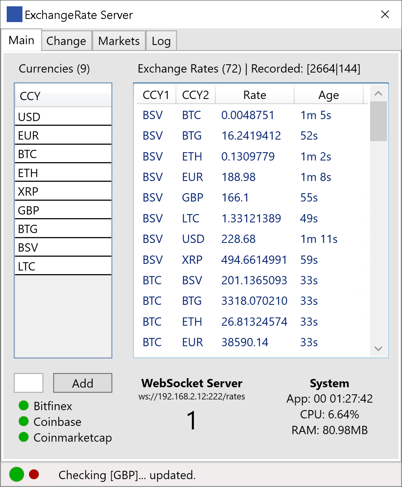
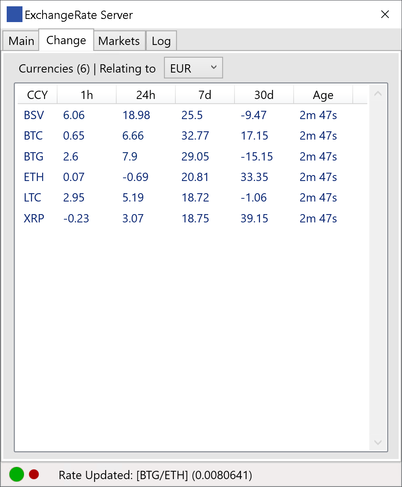
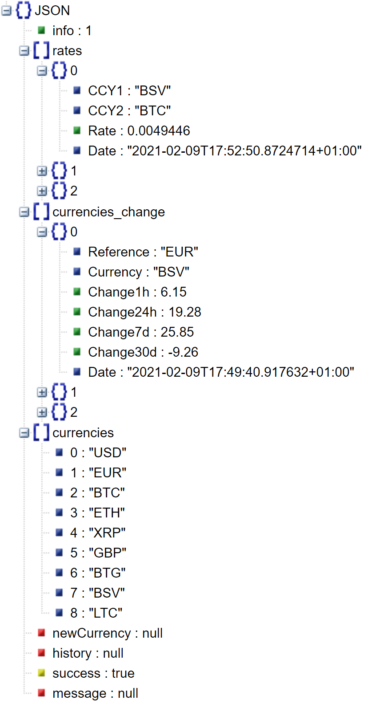

# CryptoExchangeRateServer

Exchange Rate Server for Cryptocurrencies (Using Bitfinex, Coinmarketcap API and Coinbase API)

## Built with .NET 4.7.2 on WPF

The *Exchange Rate Server* casts latest **Rate & Changes (1h,24h,7d,30d)** as well as available Markets (BitcoinDE & BitfinexCOM) and on request historic rates via a WebSocketServer on the Network.
Auto-generates pairs based on the addition of new Currencies by manual input or WebSocket request. Casts updates every 3secs.

* Ideal for Windows Server
* Access via Tray Icon
* Low Resource Usage

To add a new Currency via a Websocket Client *CURRENCY.CURRENCY* to the Websocket Server.
To request recorded rates of up to three hours, send *HISTORY.CURRENCY* to the WebSocket Server.

## Sample JSON Websocket Server Cast

## Modify Settings by editing the *config.txt* with the following entries

      CMCAPIKEY=yourapikey
      WSSENDPOINT=/yourendpoint
      REFERENCECURRENCY=EUR
      PORT=222
