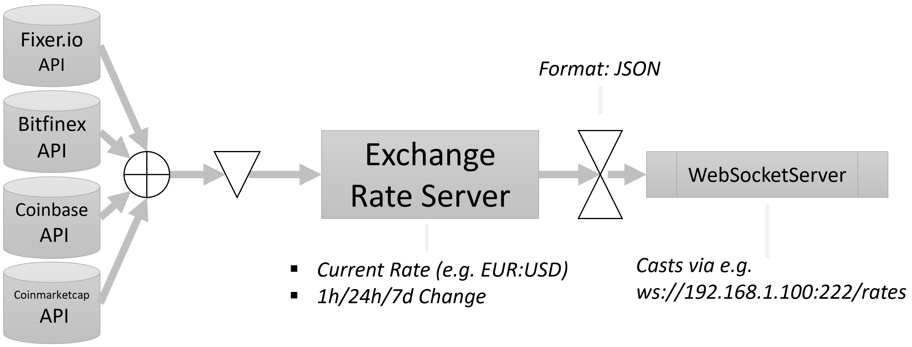
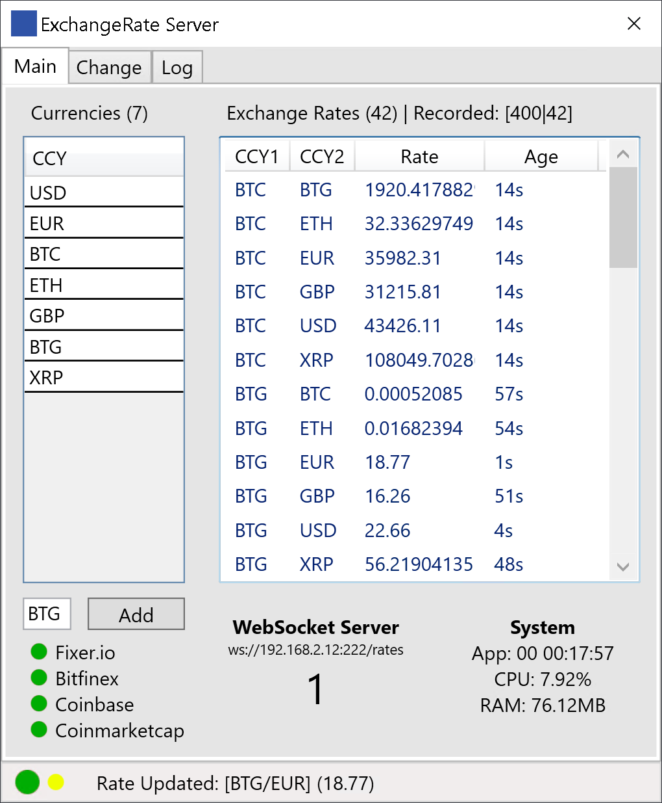
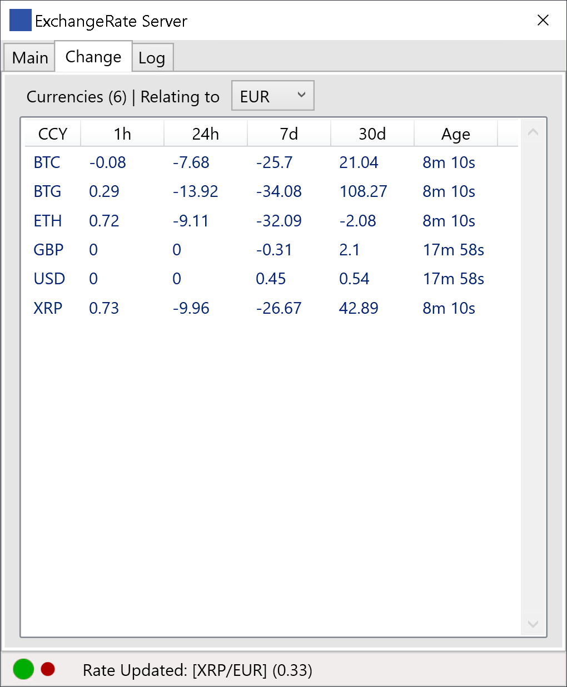

# CryptoExchangeRateServer

Exchange Rate Server for Cryptocurrencies (Using the FREE plans of Fixer.IO API, Bitfinex API, Coinmarketcap API and Coinbase API)

## Built on .NET 5 WPF

The *Exchange Rate Server* casts latest **Rates & Changes (1h, 24h, 7d, 30d)** and on request historic info via a WebSocket server on the network.
Auto-generates pairs based on the addition of new currencies by manual input or WebSocket request. Casts updates every 3secs.

* Ideal for Windows Server
* Access via tray icon
* Low resource usage

To add a new currency via a Websocket client *CURRENCY.CURRENCY* (e.g. CURRENCY.CHF) to the WebSocket server.

For recorded rates of up to three hours send *HISTORY.BASE.QUOTE* (e.g. HISTORY.CHF.EUR) to the WebSocket server.

To request an individual Exchange Rate for a pair send *PAIR.CCY1.CCY2.EXCHANGE* (e.g. PAIR.BTC.EUR.BITFINEX) to the WebSocket server.

## Setup via *config.txt* 

      FIXERAPIKEY=yourapikey
      CMCAPIKEY=yourapikey
      WSSENDPOINT=/yourendpoint
      REFERENCECURRENCY=EUR
      PORT=222

## Start-Up Flag

Usage: **ExchangeRateServer.exe /flag**

Flag _/log_: Displays log tab and saves these system messages into a log file.
Flag _/debug_: Displays debug messages in the log tab.

## Sample JSON Websocket Server Cast

